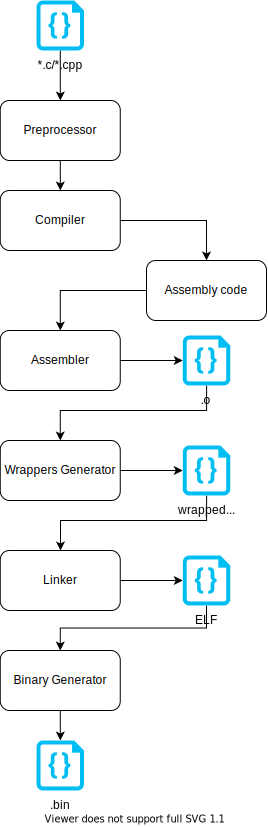

# Dynamic execution without MMU

## Overview

MSOS is capable to dynamically load and execute binaries from internal flash / external memories without MMU. In world with MMU binaries when OS loads binary sets addresses translations from physical to virtual. This allows to load binary in every place in memory and MMU takes care of translation for memory access requested from code to physical memory available in hardware. Thanks to MMU code always calls sames addresses from code point of view.

In embedded devices MMU peripheral is rarely available. But still there is option to make dynamic loading with little different approach.

Since hardware is not capable to isolate binary in virtual address space binary can't requests memory with hardcoded addresses. All memory operations must be relative to position where binary is loaded in memory.

Such code generation is possible in most of compilers and called position independent code.

Binaries compiled as position independent executable (-fPIE flag) does all calls to memory with memory offset.
OS when loads binary must fill all required offsets used in binary. All relocations are written in ELF file.

## Possible approach
Build binary as position independent and create ELF loader in OS.

Pros:
+ pure compiler solution, just compile binary with -fPIC/-fPIE
+ ELF is very known standard for describing binaries

Cons:
+ ELF file size is to huge to fit in tiny devices

## Modified approach
MSOS uses modified solution. ELF file created from toolchain linking procedure is parsed to specific format. This saves a lot of space, but requires additional step in building workflow.

This approach is inspired from project hosted at:
https://github.com/bogdanm/udynlink

### Compilation process



Additional steps:
+ wrappers generators, which wraps calls in *.o files to inject offset table management

+ binary generation, which translates ELF files to custom format

### Wrappers generation

When code is compiled to position independent for ARM compiler reserves register `r9` to store address of symbol offset table. Wrapping procedure renames real symbols from executable/library and injects code that fetches from OS address of required symbol table and updates r9 register. For example for symbol `main` wrapper renames symbol from object file to `main_dl_original` after that replaces `main` sybmol with code:
```assembly
main:
    push    {r9, lr}
    push    {r0, r1}
    mov     r0, #0x20000000
    ldr     r1, [r0, #0]
    mov     r0, pc
    blx     r1
    mov     r9, r0
    pop     {r0, r1}
    bl      main_dl_original
    pop     {r9, pc}
```

Address `0x20000000` is location where OS puts address of function that will resolve address of symbol table.

**Note**: in future this hardcoded address should be passed to script and comes from linker script that links MSOS.

### Binary generation

ELF file is parsed by script to generate custom format.
There are is a few steps to generate binary.
Firstly all relocations are translated, symbols table created and binary generated in format.

Important is that script does all relocations on binary which can be done staticaly,
i.e: changes relocation offsets to be valid in generated symbol table.

```console
    +---+---+---+---+
    |   |   |   |   | = 4 Bytes
    +---+---+---+---+

    +---+---+---+---+
    | M | S | D | L |    magic cookie
    +---+---+---+---+
    |  ver  | n.libs|    ver - version of header, n.libs - number of required libs
    +---+---+---+---+
    |   code size   |    size of .text section
    +---+---+---+---+
    |   data size   |    size of .data section
    +---+---+---+---+
    |   bss size    |    size of .bss section
    +---+---+---+---+
    | n.rel | n.sym |    n.rel -> number of relocations, n.sym -> number of symbols
    +---+---+---+---+
    | s.siz | l.nam |    s.siz -> symbols size, l.nam -> name size
    +---+---+---+---+
    |     name      |    binary/library name
    : aligned to 4  :
    +---+---+---+---+
    | l.rel. size   |    l.rel. size -> local relocations size
    +---+---+---+---+
    |  relocations  |    local relocations
    |   n-rel - 1   |
    :     n-rel     :
    +---+---+---+---+
    |  symbol table |    symbol table
    |   s.siz - 1   |
    :     s.siz     :
    +---+---+---+---+
    |  Libs table   |
    |   n.libs - 1  |
    :     n.libs    :
    +---+---+---+---+
    |     .text     |    .text section
    :               :
    +---+---+---+---+
    |     .data     |    .data section
    :               :
    +---+---+---+---+

Symbol table entry
    +---+---+---+---+
    |  size | sect  |    size -> name size, sect -> symbol section
    +---+---+---+---|
    |    offset     |    offset -> symbol offset
    +---+---+---+---|
    |     name      |    symbol name
    :               :
    +---+---+---+---+

Libs table entry
    +---+---+---+---+
    | n.len | ver   |    n.len -> name length, ver -> library version
    +---+---+---+---|
    |     name      |
    :               :
    +---+---+---+---+

Relocation table entry
    +---+---+---+---+
    |   rel index   |
    +---+---+---+---|
    |  sym offset   |
    +---+---+---+---|

```